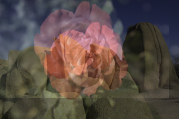

# Deghosting

* Avinash Prabhu - 2018102027
* Mallika Subramanian - 2018101041
* Fiza Husain - 20181010
* Tanvi Karandikar - 2018101059

## How to run the code
```
cd src/
deghost(image_path, label_x, label_y, dk_thresh, ck_thresh)
```

## Inputs
* `image_path`: Relative(wrt `src/`) or absolute path of the image to be saved. Image should be in png format.
* `label_x`: Direction of horizontal shift (see below)
* `label_y`: Direction of vertical shift (see below)
* `dk_thresh`: Threshold value to be used to select which candidates for dk shift from correlation should be considered.
* `ck_thresh`: Threshold value to be used to select which candidates are considered as patches with 'high correlation'

## Selecting label_x and label_y

In order to improve output accuracy, the user can give an input in which they specify the direction of the shift. We use shift of the second reflection wrt to the first. User is required to input their estimate of the shift direction.<br>
First reflection is the brighter/sharper one.<br>

Second is to the <label_x> of the first.
| Horizontal Direction | Label x |
| --- | --- |
| Left | l |
| Right | r |
| Unsure | - |
<br>


Second is to the <label_y> of the first. <br>
| Vertical Direction | Label y |
| --- | --- |
| Down | d |
| Up | u |
| Unsure | - |

"-" can be inputted when the shift direction is not obvious. 

## Choosing the thresholds ck_thresh and dk_thresh

`ck_thresh` and `dk_thresh` will differ from image to image, since they depend on factors such as lighting, the thickness of the glass, etc.

In general:<br>
`dk_thresh` can be taken in the range 0 - 100<br>
`ck_thresh` can be taken in the range 0.5 - 0.9<br>

## Outputs

The algorithm outputs the separated reflection and transmission layers as separate images. Outputs are saved in the `outputs/` directory. 
The outputs are:
* `<input_image_name>_input.png` : The input image
* `<input_image_name>_reflection.png` : The extracted reflection image
* `<input_image_name>_transmission.png` : The extracted transmission image

# Example

<br>
In this image we can clearly see that the rose is part of the reflected portion, by ghosting cues.<br>
The fainter rose (second reflection) is to the <b>top</b> and <b>left</b> of the darker rose (first reflection).<br>
Hence we pass `label_x` as "l" and `label_y` as "t".

Function call:
```
deghost("../images/prova_2.png", "l", "t", 0, 0.85)
```